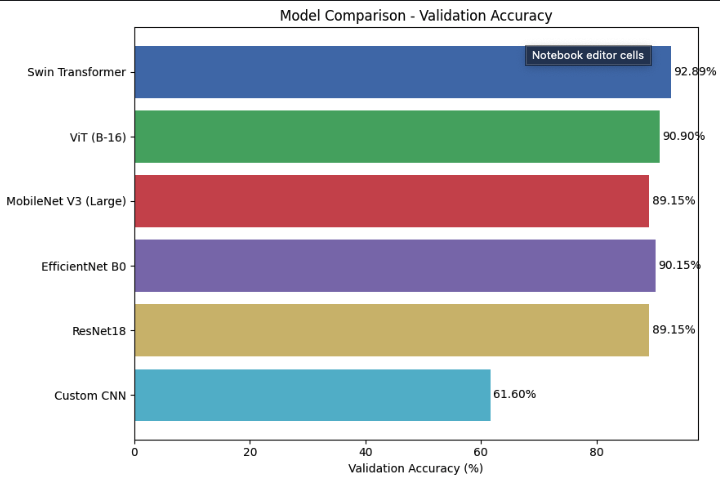

# 📊 Vision Models Playground: CNNs vs Transformers

This repository presents a comprehensive comparison of deep learning models for image classification, including both Convolutional Neural Networks (CNNs) and Vision Transformers (ViTs). The goal is to evaluate their performance on a 7-class image classification dataset and analyze their trade-offs.

---

## 🧠 Project Objective

To benchmark various image classification models on the same dataset using consistent training, validation, and evaluation strategies — and identify the best-performing architecture for the task.

---

## 🚀 Models Evaluated

| Model                | Type                | Validation Accuracy (%) |
|---------------------|---------------------|--------------------------|
| **Swin Transformer**     | Vision Transformer   | **92.892**               |
| ViT (B-16)           | Vision Transformer   | 90.897                   |
| EfficientNet B0      | CNN (Efficient)      | 90.149                   |
| MobileNet V3 Large   | CNN (Lightweight)    | 89.152                   |
| ResNet18             | CNN (Baseline)       | 89.152                   |
| Custom CNN           | CNN (From Scratch)   | 61.600                   |

---

## 📈 Performance Comparison

> The Swin Transformer outperforms all other models on the validation dataset, closely followed by ViT and EfficientNet.

---

## 🛠️ Tech Stack

- PyTorch
- TorchVision
- Scikit-learn
- Matplotlib
- Jupyter / Kaggle Notebooks

---

## 📦 Dataset Structure
The dataset consists of 7 classes representing various plant disease categories. 
### 🏷️ Class Labels

| Class         | Label |
|---------------|--------|
| Bacteria      | 0      |
| Fungi         | 1      |
| Healthy       | 2      |
| Nematode      | 3      |
| Pest          | 4      |
| Phytopthora   | 5      |
| Virus         | 6      |
## 🖼️ Sample Images from Dataset

Below is a visual sample from each class.

